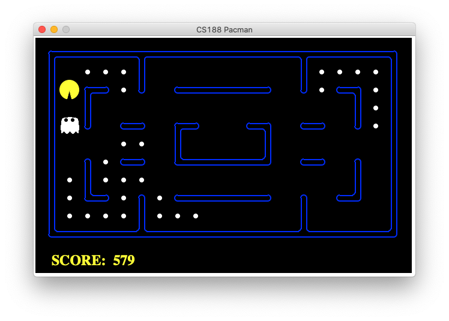

# Pacman AI
Jussi Doherty
CAP 4601 - Introduction to Artificial Intelligence - Fall 2020
Python version 3.0+

## Source of this project
This repo contains a Pac-Man project adopted from UC Berkeley's introductory artificial intelligence class, [CS188 Intro to AI](http://ai.berkeley.edu/project_overview.html). 

## Reflex agent
First, I improved the **Reflex Agent** so that it plays the game respectably. A capable reflex agent considers both food locations and ghost locations.

To try out the reflex agent on the default *mediumClassic* layout with one ghost or two:
```
python pacman.py —frameTime 0 -p ReflexAgent -k 1
python pacman.py --frameTime 0 -p ReflexAgent -k 2
```

To run the reflex agent through the autograder with graphics:
```
python autograder.py -q q1 —no-graphics
```

To run it without graphics:
```
python autograder.py -q q1 --no-graphics
```

## Minimax agent
A correct implementation of minimax will lead to Pacman losing the game in some tests. This is not a problem as it is correct behavior, and it will pass the tests.

To run the minimax agent on the *smallClassic* layout:
```
python pacman.py --frameTime 0 -p MinimaxAgent -k 1
python pacman.py --frameTime 0 -p MinimaxAgent -k 2
```

To run the minimax agent through the autograder with graphics:
```
python autograder.py -q q1 —no-graphics
```

To run it without graphics:
```
python autograder.py -q q1 --no-graphics
```
